# VetControl - Sistema de Inventario para Clínicas y Tiendas Veterinarias 🐾

**VetControl** es un sistema web completo de inventario diseñado para gestionar productos, usuarios, categorías, movimientos de stock (entradas/salidas) y reportes. Desarrollado como parte de mi portafolio profesional para demostrar habilidades backend con Java y Spring Boot.

## 🚀 Características

- Gestión de usuarios con roles (ADMIN, OPERADOR)
- Control de productos, categorías y movimientos de inventario
- Dashboard de reportes con exportación a PDF/Excel
- Seguridad con Spring Security y JWT
- API REST documentada con Swagger
- Autenticación mediante formulario
- Dockerizado y listo para producción
- Interfaz moderna con Thymeleaf y Bootstrap 5

## 🛠️ Tecnologías utilizadas

- Java 21 + Spring Boot 3
- Spring Security + JWT
- MySQL 8
- Thymeleaf + Bootstrap 5
- Maven + Docker + Docker Compose
- Swagger/OpenAPI 3 (springdoc-openapi)
- Apache POI para exportar reportes
- Arquitectura por capas (Controller, Service, Repository, DTO)

## ⚙️ Estructura del proyecto

```bash
vetcontrol/
├── src/
│   ├── main/
│   │   ├── java/com/vetcontrol/
│   │   │   ├── controller/
│   │   │   ├── service/
│   │   │   ├── dto/
│   │   │   ├── repository/
│   │   │   └── VetcontrolApplication.java
│   │   └── resources/
│   │       ├── templates/
│   │       ├── static/
│   │       └── application.properties
├── Dockerfile
├── docker-compose.yml
├── README.md
└── screenshots/
```

## 🖼️ Capturas de pantalla

### Login
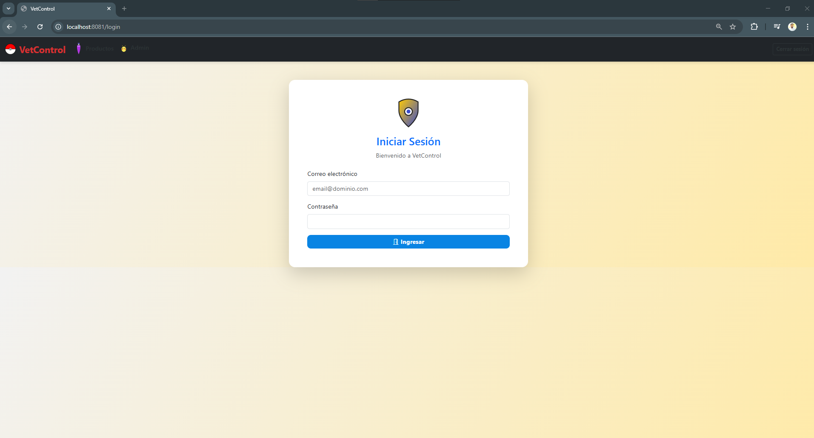

### Panel de Inicio
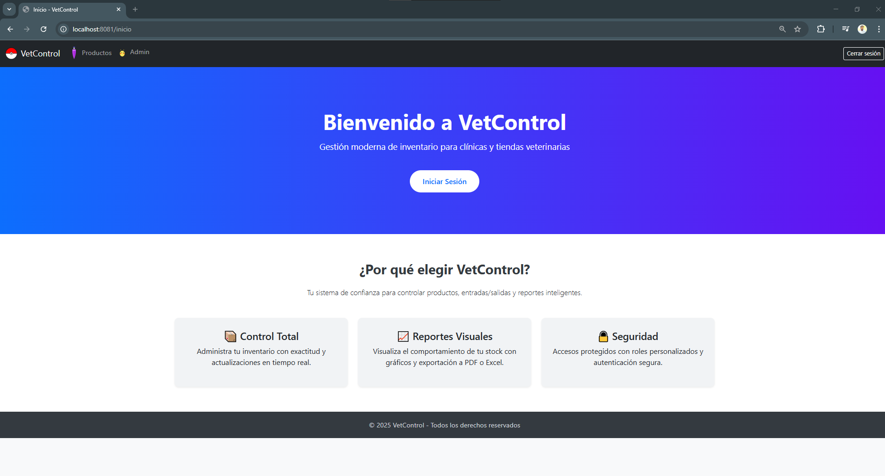

### Dashboard Administrativo
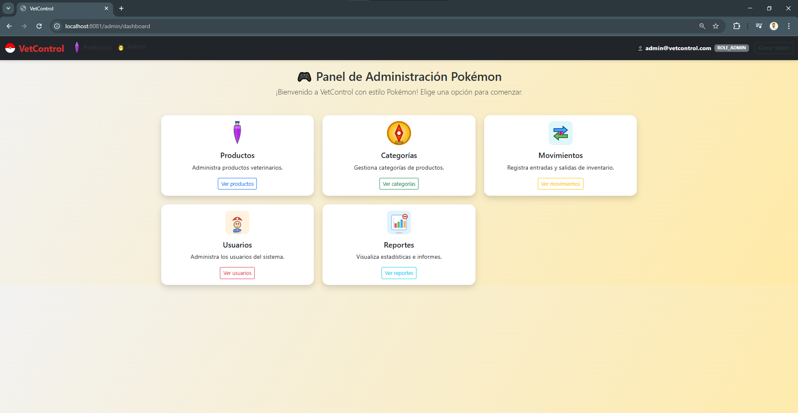

### Gestión de Usuarios
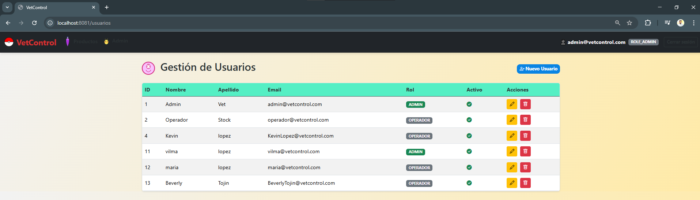
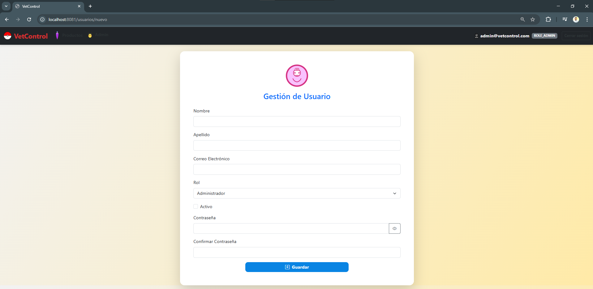

### Gestión de Productos y Categorías
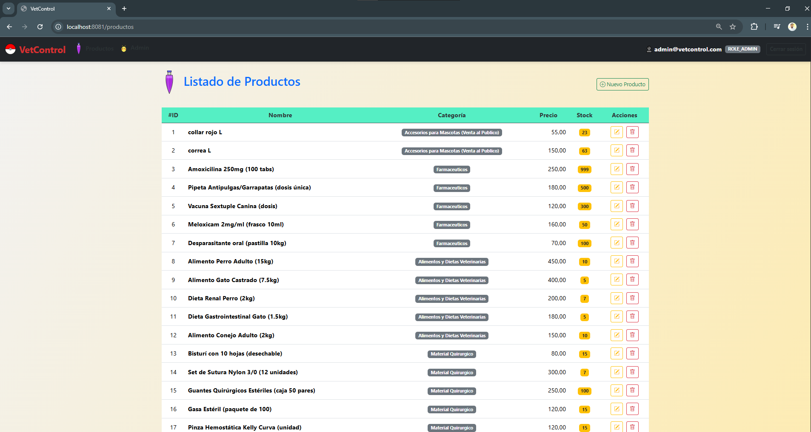
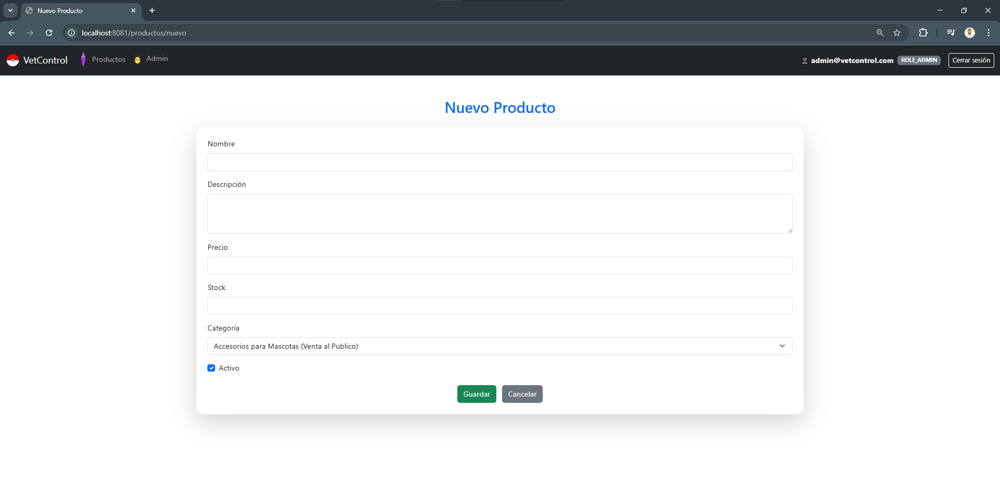
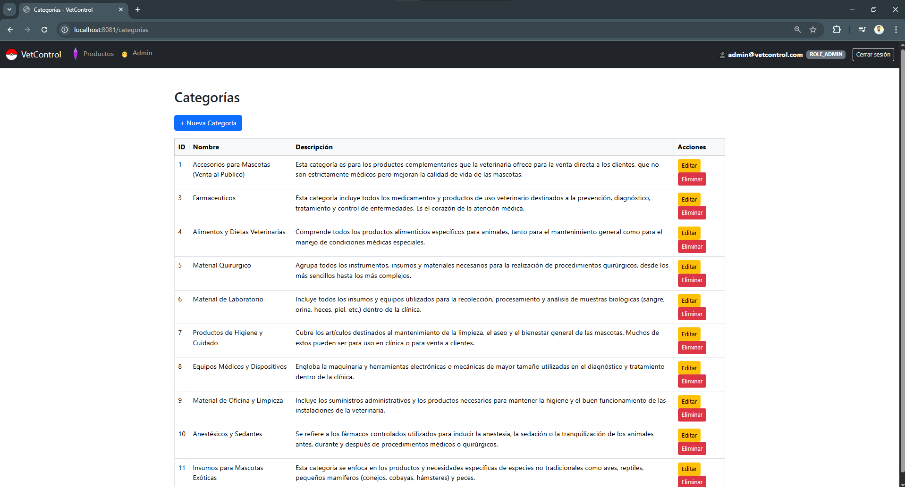
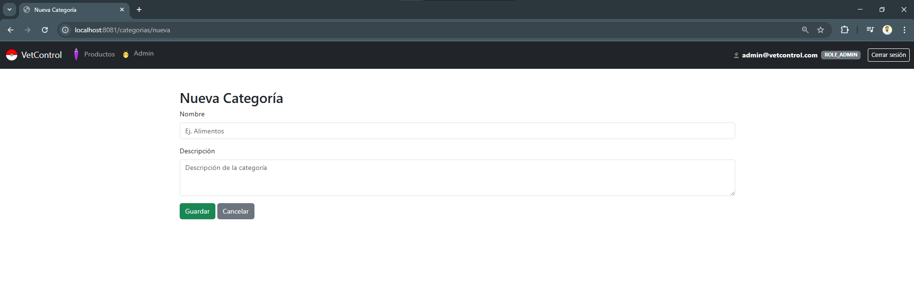

### Movimientos de Inventario
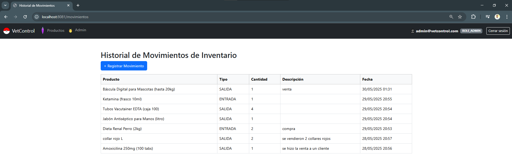
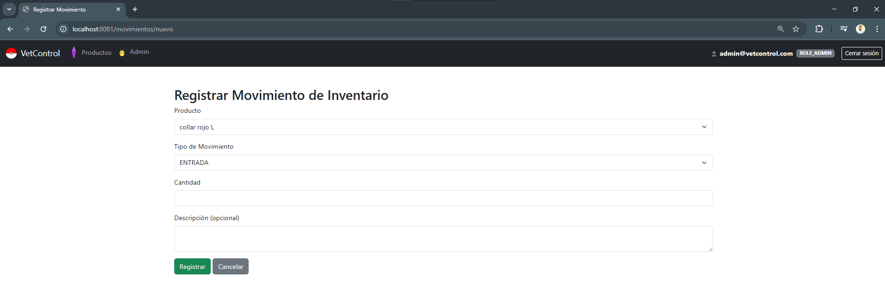

### Reportes
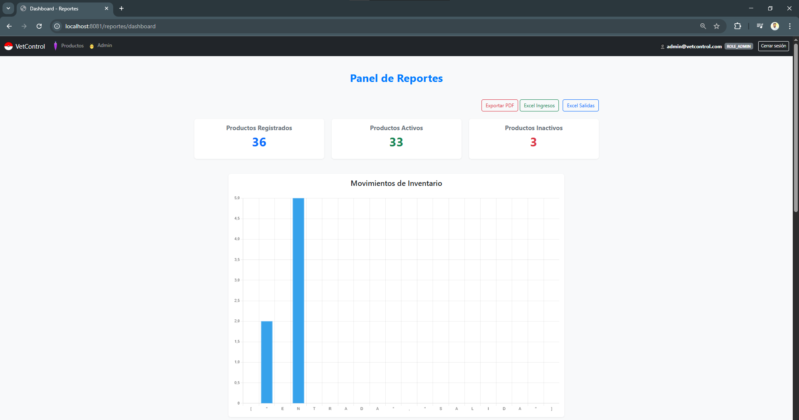
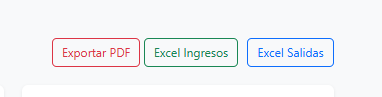

### Swagger UI - Documentación API
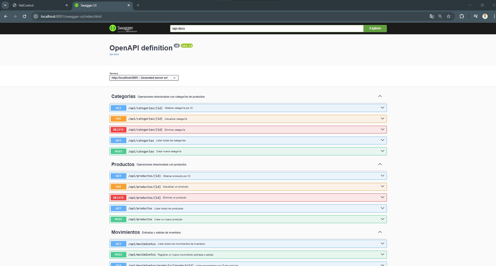

## 🐳 Instrucciones para levantar el proyecto con Docker

1. Clonar el repositorio:
   ```bash
   git clone https://github.com/KalgKevin1996/VetControl.git
   cd vetcontrol
   ```

2. Construir y levantar los contenedores:
   ```bash
   docker-compose up --build
   ```

3. Acceder desde el navegador:
    - App: [http://localhost:8081/login](http://localhost:8081/login)
    - Swagger: [http://localhost:8081/swagger-ui.html](http://localhost:8081/swagger-ui.html)

## 👥 Usuarios iniciales

| Rol     | Email                  | Contraseña |
|---------|------------------------|------------|
| Admin   | admin@vetcontrol.com   | admin123   |
| Operador| operador@vetcontrol.com| operador123|

> Estos usuarios pueden ser usados para iniciar sesión y probar las funcionalidades.

## 📦 Despliegue

VetControl está listo para ser desplegado en servicios como AWS EC2, DockerHub o mediante CI/CD. Incluye healthcheck para base de datos, configuración externa por variables de entorno y persistencia de datos con volúmenes.

## 📌 Autor

**Kevin Antonio López Gómez**  
📫 kalgkevin1996@gmail.com 

📫 kalg.antonio.lopez@gmail.com

📞 +(502)45130355

---

🧩 Este proyecto demuestra mi dominio de Java Backend, arquitectura limpia, seguridad, documentación, buenas prácticas y despliegue profesional.
